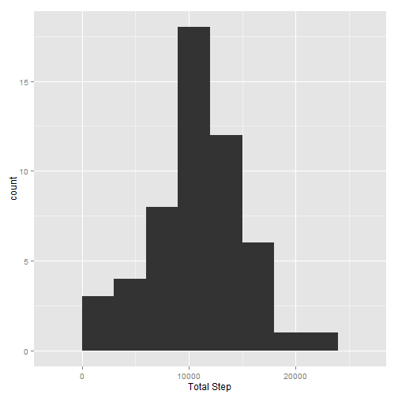
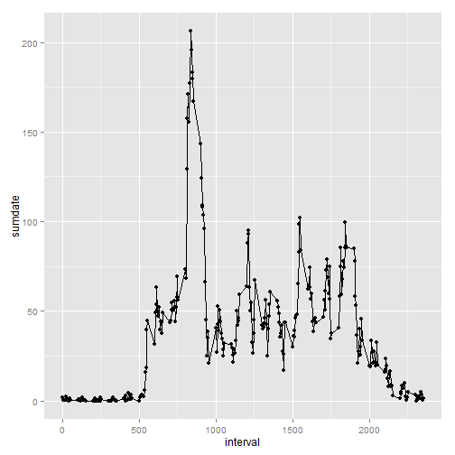
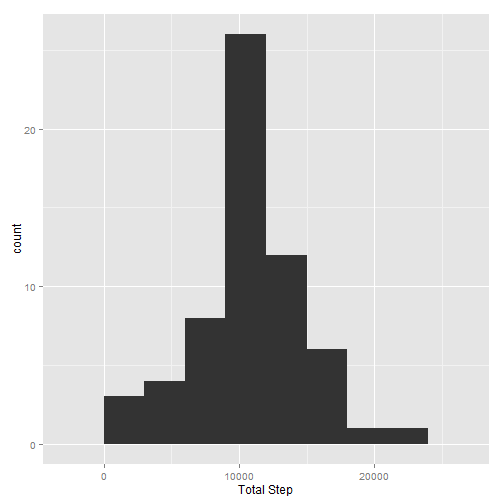
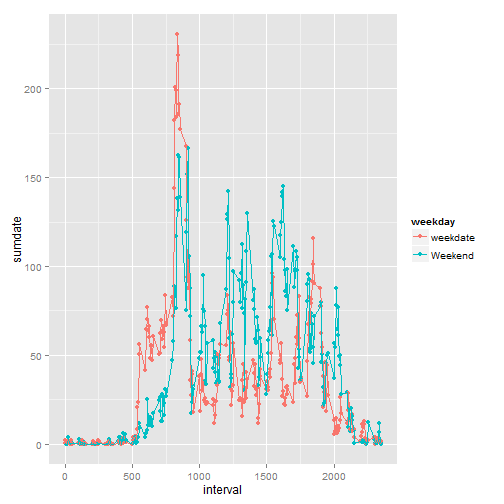

Let us examine the data collected by a group of people on thier daily walking habits. Let us look at aggerate analysis by looking at the avearge steps they took per data. The best way to look at the data is by histogram


```r
library(ggplot2)
library(dplyr)

setwd("C:/Users/smurthy/Downloads/DS_reproduce")

activityDB<-read.csv("activity.csv")
activityDBnoNA<-na.omit(activityDB)
dateGroup<-group_by(activityDBnoNA,date)
stepsum<-summarize(dateGroup,sumdate=sum(steps,na.rm=TRUE))
stepsum$date<-as.POSIXct(stepsum$date)

qplot(sumdate,data=stepsum,xlab="Total Step")+geom_histogram(binwidth=3000)
```

```
## stat_bin: binwidth defaulted to range/30. Use 'binwidth = x' to adjust this.
```

 

The mean step taken is 10766.19 and median is 10765

Let us examine the habit within the days to see if there is a pattern during the days. This is best examined by ploting the average per interval across the days.


```r
mean(stepsum$sumdate,na.rm=TRUE)
```

```
## [1] 10766.19
```

```r
median(stepsum$sumdate,na.rm =TRUE)
```

```
## [1] 10765
```

```r
dateGroups<-group_by(activityDBnoNA,interval)
stepsumI<-summarize(dateGroups,sumdate=mean(steps,na.rm=TRUE))
qplot(interval,sumdate,data=stepsumI)+geom_line()
```

 

The interval the max steps were taken and average amount is

```r
stepsumI[stepsumI$sumdate==max(stepsumI$sumdate),]
```

```
## Source: local data frame [1 x 2]
## 
##   interval  sumdate
## 1      835 206.1698
```

Ofcourse the data has missing values. The number of missing values

```r
sum(is.na(activityDB))
```

```
## [1] 2304
```

out of 17568. Which is about 4.5%
If we impute the missing data and reexamine the data we get

```r
dataGroup1<-group_by(activityDBnoNA,interval)
stepNA<-summarize(dataGroup1,sumdate=mean(steps,na.rm=TRUE))

dateGroupna<-group_by(activityDB,date)
stepwithna<-summarize(dateGroupna,sumdate=sum(steps))


actall<-merge(activityDB,stepNA,by.x="interval",by.y="interval",all=TRUE)
actall$steps[is.na(actall$steps)]<-actall$sumdate[is.na(actall$steps)]
groupall<-group_by(actall,date)
stepsumall<-summarize(groupall,sumdate=sum(steps,na.rm=TRUE))


qplot(sumdate,data=stepsumall,xlab="Total Step")+geom_histogram(binwidth=3000)
```

```
## stat_bin: binwidth defaulted to range/30. Use 'binwidth = x' to adjust this.
```

 

The mean is 10766.19 and the median is 10766.19

Since the difference is very small, the missing value is not significent.

Assuming everyone in this study is working, is there a differnce between weekdate and weeknend.

```r
actall$date<-as.POSIXct(actall$date)
actall$weekday<-ifelse(weekdays(actall$date,abbr=TRUE) %in% c("Sun","Sat"),"Weekend","weekdate")

datelast<-group_by(actall,interval,weekday)
stepsuml<-summarize(datelast,sumdate=mean(steps,na.rm=TRUE))
qplot(interval,sumdate,data=stepsuml,group=weekday,color=weekday)+geom_line()
```

 


